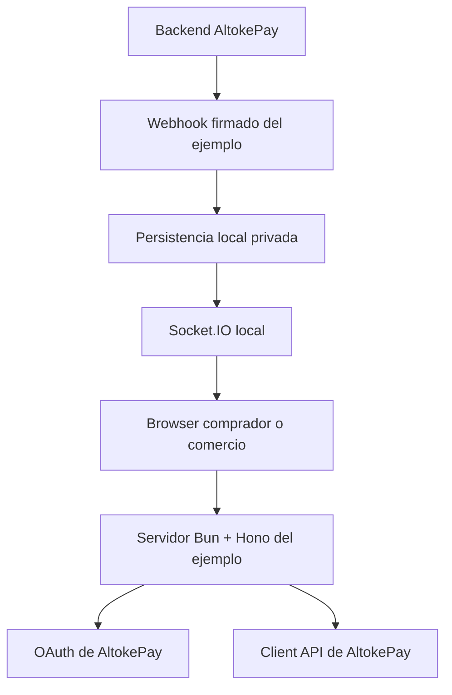

# Ejemplo de incorporación de AltokePay

Aplicación de referencia para integrar la **Client API de AltokePay** desde un backend propio con **Bun 1.4 y Hono 4.13**. El proyecto demuestra autenticación OAuth servidor a servidor, creación y recuperación de cobros, Links de Pago, validación de webhooks firmados y persistencia local segura sin exponer credenciales al navegador.

> Este repositorio es una referencia educativa de integración, no una tienda lista para producción. Antes de desplegarlo debes reemplazar la persistencia JSON, terminar TLS, administrar secretos fuera del filesystem de la aplicación y adaptar autenticación, observabilidad y recuperación a tu infraestructura.

## Qué demuestra

| Experiencia | Usuario | Contrato AltokePay | Confirmación |
|---|---|---|---|
| Checkout de ecommerce | Comprador | Seis operaciones puntuales de `/api/v1/client/checkouts` | Webhook firmado; las lecturas HTTP solo recuperan estado |
| Panel de Links de Pago | Comercio | Cinco operaciones puntuales de `/api/v1/client/payment-links` | Estado autoritativo de AltokePay y webhook cuando existe un Checkout asociado |

Los dos flujos son deliberadamente independientes:

- **Checkout local** solicita el DNI dentro de una sesión temporal protegida, crea un Checkout para una compra concreta y libera la orden únicamente después de procesar el snapshot de un webhook válido.
- **Panel comercial de Links de Pago** mantiene un inventario propio de Links, permite crear cobros con DNI o nombre directo y no usa productos, tarjetas ni la sesión del comprador.

Desde la portada, **“Crear Link como comercio” abre `/payment-links.html` directamente** y solicita las credenciales HTTP Basic del comercio. No redirige al catálogo ni mezcla el Link con un Checkout de producto. El navegador nunca recibe la API key, access/refresh tokens OAuth, el DNI persistido, el secreto webhook ni las capabilities públicas almacenadas por el servidor.

## Inicio rápido

### Requisitos

- [Bun 1.4](https://bun.sh/) o una versión compatible declarada en `package.json`.
- Una organización AltokePay de Sandbox.
- Una API key con los cinco scopes indicados abajo.
- Un endpoint webhook de AltokePay cuyo destino sea `EXAMPLE_PUBLIC_URL/webhooks/altokepay`.

### Instalación

```bash
git clone https://github.com/Yeferson-gm/EJEMPLO-DE-INCORPORACION-DE-ALTOKEPAY.git
cd EJEMPLO-DE-INCORPORACION-DE-ALTOKEPAY
bun install
cp .env.example .env
bun run dev
```

La aplicación queda disponible, por defecto, en `http://localhost:3001`.

### Configuración

`.env.example` contiene exclusivamente nombres y valores de muestra y sí se versiona. `.env` contiene credenciales reales, está ignorado por Git y **nunca debe publicarse**.

| Variable | Propósito |
|---|---|
| `ALTOKEPAY_BASE_URL` | Origen HTTPS del backend AltokePay; puede ser local durante desarrollo. |
| `ALTOKEPAY_API_KEY` | Credencial bootstrap server-side para obtener tokens OAuth. |
| `ALTOKEPAY_WEBHOOK_SECRET` | Secreto usado para verificar HMAC-SHA-256 de webhooks. |
| `ALTOKEPAY_ENVIRONMENT` | Entorno esperado: `sandbox` o `production`. |
| `EXAMPLE_PORT` | Puerto HTTP local del ejemplo. |
| `EXAMPLE_PUBLIC_URL` | Origen público usado para configurar el webhook. |
| `EXAMPLE_MERCHANT_USERNAME` | Usuario HTTP Basic del panel comercial. |
| `EXAMPLE_MERCHANT_PASSWORD` | Contraseña aleatoria y exclusiva del panel comercial. |

La API key debe incluir exactamente las capacidades utilizadas por esta referencia:

```text
payment-methods:read
checkouts:read
checkouts:write
payment-links:read
payment-links:write
```

`ALTOKEPAY_ENVIRONMENT` debe coincidir con `/api/v1/client/auth/me` y con el entorno firmado en cada webhook. Durante el arranque, el servidor intercambia o renueva la sesión OAuth y valida identidad, entorno y scopes. Una configuración incompleta o contradictoria impide iniciar para evitar operar silenciosamente contra el tenant equivocado.

`EXAMPLE_MERCHANT_USERNAME` admite entre 3 y 64 caracteres sin espacios, controles ni `:`. `EXAMPLE_MERCHANT_PASSWORD` exige entre 16 y 256 caracteres sin controles; usa un valor generado aleatoriamente y no lo reutilices.

## Recorrido recomendado

1. Inicia AltokePay y este ejemplo con una organización Sandbox.
2. Abre `/` y prueba **Comprar con Checkout** como comprador.
3. Configura el DNI temporal; el servidor lo mantiene fuera del navegador después de crear la sesión.
4. Crea el Checkout, paga usando las instrucciones y deja que el webhook firmado confirme la orden.
5. Regresa a `/` y abre **Crear Link como comercio**.
6. Autentícate con las credenciales merchant y crea, recupera, revisa o cancela Links desde `/payment-links.html`.

No automatices llamadas periódicas a los endpoints de estado. Las consultas incluidas son acciones puntuales de carga, recuperación manual o reacción a una señal realtime.

## Arquitectura



Todas las credenciales y llamadas Client API terminan en el servidor del ejemplo. El browser solo consume rutas locales estrechas. AltokePay conserva la autoridad del pago; el ejemplo conserva la autoridad sobre su orden o inventario comercial y procesa webhooks de forma idempotente.

### Stack y estructura

- `index.ts` carga el composition root.
- `src/services/server.ts` compone `Bun.serve`, Hono y `@socket.io/bun-engine`.
- `src/app.ts` aplica headers defensivos, autenticación merchant antes de routes/static, límites, rutas y assets.
- `src/services/altokePayClient.ts` es la única puerta OAuth hacia `/api/v1/client/*` y conserva sólo códigos upstream incluidos en una allowlist local segura.
- `src/routes/checkoutRoutes.ts` expone únicamente catálogo, sesión de pagador y operaciones locales de Checkout.
- `src/routes/paymentLinkRoutes.ts` expone únicamente el inventario y las mutaciones locales de Payment Links.
- `src/services/orderService.ts` mantiene las órdenes Checkout y procesa snapshots webhook.
- `src/services/merchantPaymentLinkService.ts` mantiene el inventario comercial local y usa únicamente operaciones puntuales de Payment Links.
- `src/lib/jsonFile.ts` implementa JSON atómico y mutaciones serializadas.
- `public/*.js` permanece como browser JavaScript y se valida con `checkJs` dedicado.

Los imports del servidor y tests usan aliases absolutos `#config/*`, `#data/*`, `#domain/*`, `#lib/*`, `#realtime/*`, `#routes/*` y `#services/*`.

## Datos demo y privacidad

`config/products.json` es el único catálogo versionado y se valida de forma estricta con Valibot durante el import. `config/customer.json` ya no existe.

`POST /api/session/payer` valida el DNI para Checkout, deriva un UUID interno, rota la capability de sesión y devuelve sólo `{ payer: { configured: true } }`. `GET /api/session/payer` recupera esa proyección o `null`; el DNI permanece server-side para construir el Checkout. Las sesiones privadas se guardan en `data/payerSessions.json`, archivo ignorado por Git. El panel de Links de pago no consulta ni usa esta sesión.

Los iconos de métodos de pago usan las URLs absolutas entregadas por AltokePay. No existe proxy local de iconos.

## Autenticación del panel merchant

`GET` y `HEAD /payment-links.html`, junto con cualquier método sobre `/api/payment-links` y `/api/payment-links/*`, requieren HTTP Basic. La ausencia, formato inválido o credenciales incorrectas responde `401 Unauthorized` con `WWW-Authenticate: Basic realm="AltokePay Merchant", charset="UTF-8"`, sin redirección ni mensajes que permitan distinguir la causa. Username y password se convierten a digests SHA-256 de longitud fija y ambos se comparan siempre con `timingSafeEqual`; sus valores no se registran.

El middleware se ejecuta antes de las rutas y de `serveStatic`, incluye paths percent-encoded equivalentes y por eso el archivo HTML no puede recuperarse mediante el fallback estático sin autenticación. La protección no se aplica a la tienda pública, assets, APIs Checkout/sesión, Socket.IO ni `/webhooks/altokepay`.

HTTP Basic sólo protege credenciales en tránsito cuando se usa HTTPS. En despliegues fuera de `localhost`, configura `EXAMPLE_PUBLIC_URL` con HTTPS y termina TLS antes de exponer este ejemplo.

## OAuth servidor a servidor

El cliente usa:

- `POST /oauth/token` con `grantType: apiKey`;
- `POST /oauth/token` con `grantType: refreshToken`;
- `GET /api/v1/client/auth/me` para scopes y entorno;
- `POST /api/v1/client/auth/logout` en `logoutAltokePayClient`, implementado para demostrar revocación sin exponerlo al browser.

Las llamadas tienen timeout de 10 segundos. El refresh es single-flight, `Authorization` no puede ser sobrescrito por callers y los errores enviados a rutas locales no incluyen mensajes, detalles ni payloads upstream. Los códigos comerciales `BILLING_PAYMENT_REQUIRED`, `IDENTITY_SERVICE_UNAVAILABLE`, `IDEMPOTENCY_CONFLICT`, `CONFLICT`, `UNPROCESSABLE_ENTITY`, `NOT_FOUND` y `TOO_MANY_REQUESTS` se traducen mediante una allowlist con status y copy locales; cualquier otro código se colapsa a `ALTOKEPAY_UNAVAILABLE`. Tokens OAuth se guardan en `data/tokens.json` con modo `0600`.

## Operaciones Client API demostradas

### Checkout: exactamente seis operaciones puntuales

1. `POST /api/v1/client/checkouts`
2. `GET /api/v1/client/checkouts/external/:externalId`
3. `GET /api/v1/client/checkouts/:id`
4. `GET /api/v1/client/checkouts/:id/status`
5. `POST /api/v1/client/checkouts/:id/cancel`
6. `POST /api/v1/client/checkouts/:id/retry`

La pantalla de Checkout usa las tres lecturas en paralelo durante una recuperación autorizada por capability: al cargar una orden, al solicitar “Revisar estado” o tras una señal realtime. No existe polling repetido. Create, las tres lecturas, cancel, retry y el catálogo de métodos validan sus DTOs upstream con schemas Valibot antes de consumirlos. Estas lecturas actualizan instrucciones y estado operativo; `expired` y `canceled` se reflejan como terminales desde el snapshot autoritativo, pero una orden solo pasa a pagada y libera la compra cuando se procesa el webhook firmado.

### Payment Links: exactamente cinco operaciones puntuales

Este flujo permanece separado de `checkout.html`: se elige desde la portada y abre un panel operativo para el comercio. La creación acepta monto, mensaje, vigencia y la unión exclusiva de identidad definida por el backend: DNI consultado por AltokePay o nombre directo. Antes del `POST` remoto persiste un intent con `intentId`, `externalId`, fingerprint y payload de recuperación; un reintento consulta primero por ese `externalId` y sólo repite el `POST` con la misma `Idempotency-Key` cuando AltokePay confirma `NOT_FOUND`. Al completarse se elimina del intent el payload de identidad. La `publicUrl` alojada por AltokePay se conserva en el archivo privado, se excluye del listado general y se devuelve verbatim sólo en creación o mediante la acción explícita “Recuperar URL”.

1. `POST /api/v1/client/payment-links`
2. `GET /api/v1/client/payment-links/external/:externalId`
3. `GET /api/v1/client/payment-links/:id`
4. `GET /api/v1/client/payment-links/:id/status`
5. `POST /api/v1/client/payment-links/:id/cancel`

No hay endpoint de listado/historial en la Client API, proxies genéricos ni proxy de la API pública/capability de Payment Links. `GET /api/payment-links` lee exclusivamente `data/paymentLinks.json`, proyecta el inventario propio del ecommerce sin `publicUrl` y nunca lista capabilities. Cada acción “Revisar estado” invoca explícitamente las tres lecturas puntuales; “Recuperar URL” usa una ruta local puntual; no existe polling. El HTML merchant y todas estas rutas locales requieren las mismas credenciales HTTP Basic.

## Autorización local de órdenes

El ID local y `externalId` son el mismo UUID v4, pero el UUID no autoriza nada. Al crear un Checkout local, el servidor:

1. genera una capability opaca aleatoria de 256 bits;
2. devuelve `orderToken` una sola vez al browser;
3. persiste únicamente SHA-256 del token dentro de la orden;
4. exige `X-Order-Token` en `GET`, cancel y retry;
5. exige `{ orderId, token }` en `order.watch` antes de unir el socket a la sala.

El browser guarda la capability en `sessionStorage`, nunca en la URL. Cada retry crea un UUID y una capability nuevos. Socket.IO usa solo WebSocket con `socket.io 4.8.3` y `@socket.io/bun-engine 0.1.2`.

## Webhook de Checkout

Configura en Admin:

```text
EXAMPLE_PUBLIC_URL/webhooks/altokepay
```

Eventos soportados: `payment.received`, `checkout.created`, `checkout.paid`, `checkout.expired`, `checkout.canceled`, `checkout.retry_created` y `webhook.ping`.

El receptor exige una sola representación válida de todos los headers:

- `X-AltokePay-Webhook-Id`
- `X-AltokePay-Delivery-Id`
- `X-AltokePay-Event-Id`
- `X-AltokePay-Environment`
- `X-AltokePay-Timestamp`
- `X-AltokePay-Signature`
- `X-AltokePay-Attempt`

La firma es `HMAC_SHA256(secret, timestamp + "." + rawBody)`, se compara en tiempo constante y el timestamp admite ±5 minutos. Valibot valida el payload. Antes de cambiar estado se cotejan:

- `payload.id` con `X-AltokePay-Event-Id`;
- environment de header, payload y configuración;
- `checkout.id` con el `checkoutId` local;
- `externalId`, amount, currency y provider;
- status esperado por tipo;
- en `checkout.paid`, amount/currency/provider y `payment.status === "processed"`;
- en `checkout.retry_created`, presencia de ambos campos `data.retry.retryOfCheckoutId` y `data.retry.retryOfExternalId`, más correspondencia con la orden retry y la orden previa locales.

No se consulta AltokePay durante el webhook: el snapshot firmado basta. Los siete tipos soportados tienen schemas explícitos. `webhook.ping` y `payment.received` se validan y registran terminalmente como `processed` con `updated: false`; no caen en `ignored_unsupported`. Un evento procesado o un tipo realmente no soportado se deduplica terminalmente. Orden ausente y fallos de procesamiento quedan como `retryable_missing_order` o `retryable_failed`; la respuesta no exitosa permite reentrega. El ACK exitoso solo depende de validación, disco local y publicación Socket.IO.

## Persistencia JSON

- `data/payerSessions.json`: DNI temporal, UUID interno y hashes de capabilities de sesión.
- `data/orders.json`: órdenes Checkout y hashes de capabilities.
- `data/paymentLinks.json`: inventario comercial privado con `publicUrl`; la proyección de listado la omite.
- `data/paymentLinkIntents.json`: intents estables; un pendiente conserva temporalmente la identidad necesaria para recuperación y un completado la elimina.
- `data/tokens.json`: sesión OAuth server-side.
- `data/webhookReceipts.json`: estado de idempotencia y deliveries.

La lectura usa fallback solo para `ENOENT`; JSON corrupto y errores I/O se propagan. Las escrituras usan temp exclusivo + `fsync` + `rename`, modo `0600`. Todas las operaciones read-modify-write de sesiones, órdenes, Links, receipts y tokens se serializan por archivo para evitar lost updates.

## Rutas locales

- `GET /api/products`
- `GET /api/payment-methods?currency=:currency`
- `GET /api/session/payer`
- `POST /api/session/payer`
- `POST /api/orders/start-checkout`
- `GET /api/payment-links` — inventario local del ecommerce; requiere HTTP Basic
- `POST /api/payment-links` — creación con identidad `dni` o `name`; requiere HTTP Basic
- `POST /api/payment-links/:paymentLinkId/refresh` — actualización explícita mediante tres lecturas puntuales; requiere HTTP Basic
- `POST /api/payment-links/:paymentLinkId/cancel` — cancelación explícita; requiere HTTP Basic
- `POST /api/payment-links/:paymentLinkId/recover-public-url` — recuperación local explícita de la capability pública; requiere HTTP Basic
- `GET /api/orders/:orderId` con `X-Order-Token`
- `POST /api/orders/:orderId/cancel-checkout` con `X-Order-Token`
- `POST /api/orders/:orderId/retry-checkout` con `X-Order-Token`
- `POST /webhooks/altokepay`

Identidad, órdenes y mutaciones llevan `Cache-Control: no-store`. La app añade CSP, `nosniff`, frame denial, referrer y permissions policy defensivas, limita bodies a 1 MiB y atiende `SIGINT`, `SIGTERM`, `SIGHUP` y `SIGQUIT` cerrando de forma awaited Socket.IO con su Bun engine y el servidor HTTP. El cierre normal termina con código `0`, ignora la entrega duplicada inmediata que puede producir `bun --watch` y mantiene un límite de 5 segundos; una señal posterior fuera de esa ventana fuerza una salida no exitosa si la limpieza quedó bloqueada.

## Comandos

| Comando | Descripción |
|---|---|
| `bun run dev` | Inicia el servidor con recarga durante desarrollo. |
| `bun run start` | Inicia el servidor sin watcher. |
| `bun run int:check` | Ejecuta TypeScript strict, `checkJs` del browser y Biome. |
| `bun run test` | Ejecuta la suite completa de contratos, seguridad y persistencia. |
| `bun run security:audit` | Falla ante vulnerabilidades de producción de severidad alta. |
| `bun run format:fix` | Aplica el formato canónico de Biome. |

La suite usa configuración ficticia explícita y debe pasar en un clon limpio sin crear `.env`. Antes de enviar cambios ejecuta:

```bash
bun run int:check
bun run test
bun run security:audit
```

La suite prueba las 6 + 5 operaciones Client API, validación runtime de DTOs Checkout, capabilities, separación de roles, HTTP Basic ausente/inválido/válido, `HEAD`, rutas merchant completas y fronteras públicas, ambas identidades de Payment Link, intent durable y recuperación tras fallo ambiguo, listado local sin capability pública, recuperación explícita de URL, ausencia de proxies y polling, persistencia atómica/serializada, los siete tipos webhook, lineage de retry, orden ausente, snapshot/idempotencia y controles OAuth.

## Antes de usar este patrón en producción

- Sustituye los archivos JSON por una base de datos transaccional con backups y control de concurrencia distribuido.
- Guarda API keys, secretos webhook y credenciales merchant en un gestor de secretos.
- Expón el servicio únicamente por HTTPS y configura correctamente el proxy inverso.
- Reemplaza HTTP Basic por la autenticación y autorización administrativa de tu producto.
- Añade logs estructurados sin PII, métricas, alertas y trazabilidad de webhooks.
- Conserva la idempotencia de Checkout, Payment Links y webhooks al migrar la persistencia.
- No confirmes pagos desde el navegador ni mediante polling; utiliza el webhook firmado y snapshots autoritativos.
